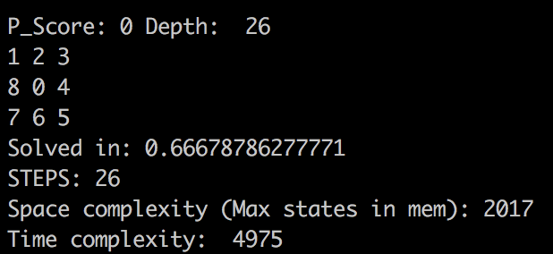

# N-puzzle
The goal of this project is to solve the N-puzzle ("taquin" in French) game using the A* search algorithm

The A* algorithm is designed to find the shortest path between two points A and B while taking into account the obstacles.   

To apply this algorithm to "le Taquin" game we are constantly looking for the best move to make between   
our 4 possibilities, indeed we can only move one square by switching it with the empty square.
To decide which one is the best option we use a cost function combined with a [Heuristic function](https://en.wikipedia.org/wiki/Heuristic_(computer_science))

Unsolved Taquin:   

Solved Taquin:   

# Usage:   

**Clonning the project**   
>git clone https://github.com/Vilucas/N-puzzle.git ; cd N-puzzle   
   
**First we generate a solvable map 3*3 by example**   
> python generator.py -s 3   

**-s is for solvable you can use -u instead, we are checking if the puzzle is solvable or not**   
**3 is about the size of the puzzle**   

> ls puzzle_3.txt ; cat puzzle_3.txt   

   

**Then we solve this map with our algorithm:**   
> python3 n_puzzle.py puzzle_3.txt    

**The program ask for a heuristic function to use for the A\* algorithm**   
   
**4th is the fastest, time complexity can be very huge with bigger maps (5x5 +) so we advise you to run with the 4th one**   

**Then you have to choose if you want to do a greedy search it means we don't calculate the cost anymore, but only use the prediction of the heuristic function**   
   

**The program is now running, wait for the results to be printed on the terminal**   
   

We choosed to do the program in Python to improve our knowledge of the  
language but doing it in C++ would have made it way way faster.

